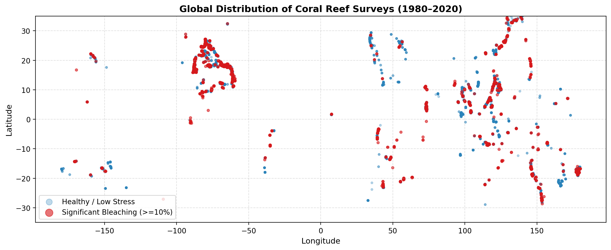
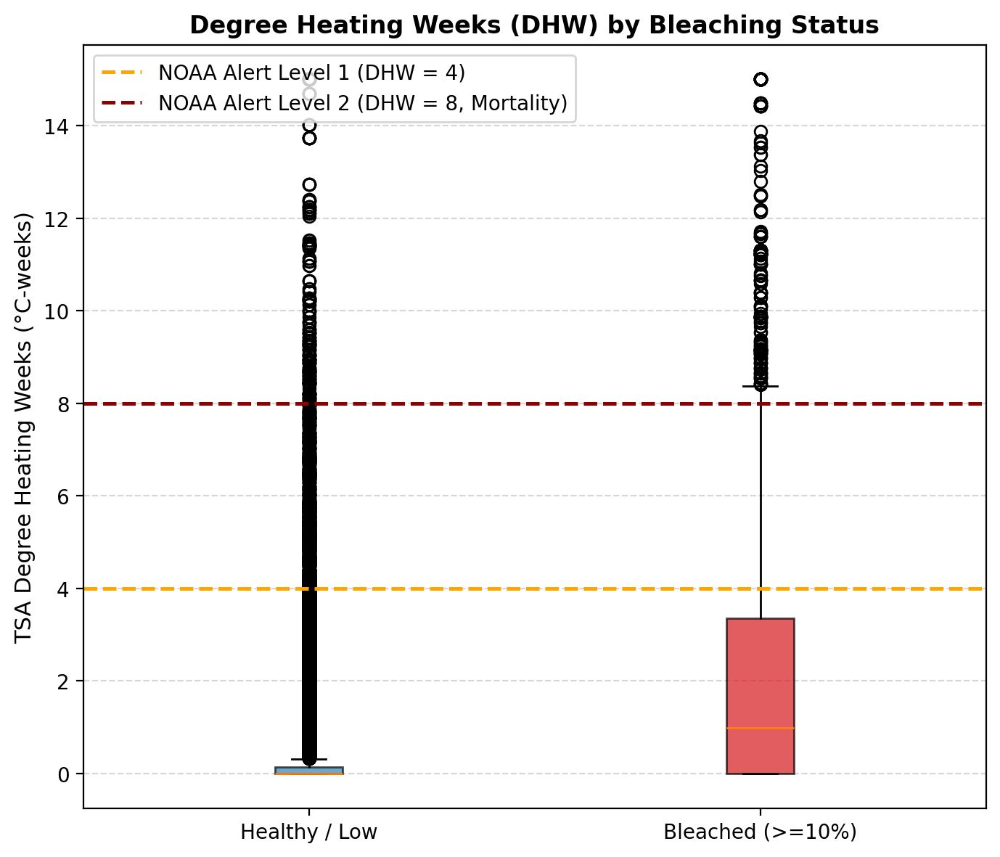
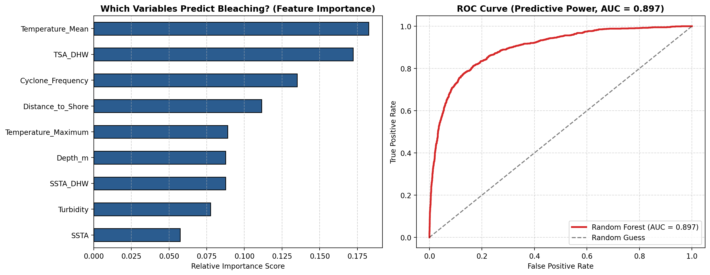

# Coral Bleaching Prediction

An exploratory data analysis and baseline predictive model evaluating how well satellite thermal stress and local environmental variables can forecast coral bleaching events.

---

## Project Overview

When ocean temperatures stay elevated for prolonged periods, corals expel their symbiotic algae (*zooxanthellae*), causing them to turn white and risk starvation. 

This project explores a dataset of over 32,000 field-verified reef surveys worldwide (1980–2020) matched with NOAA satellite temperature records. The goal is to identify which environmental factors best predict severe bleaching and to evaluate whether an automated classifier can provide reliable early warnings.

---

## Key Results

* **Predictive Skill:** A baseline Random Forest classifier evaluated on an unseen test set (6,543 reefs) achieved an **ROC-AUC of 0.897** and **88% overall accuracy**.
* **Prolonged Heat vs. Instant Heat:** Cumulative thermal accumulation (measured in NOAA Degree Heating Weeks, DHW) and mean baseline temperature are the dominant predictors, accounting for over 35% of feature importance. Single-day temperature anomalies alone carry far less predictive weight.
* **Local Modifiers:** Cyclone frequency, depth, and distance to land also play noticeable roles, likely reflecting the effects of water mixing, light buffering, and sedimentation.

---

## Exploratory Visualizations

### Global Survey Distribution (1980–2020)
Locations of field surveys across tropical reef systems, comparing healthy/low-stress sites with significantly bleached sites (≥10% bleaching).



### Degree Heating Weeks (DHW) by Bleaching Status
Comparison of heat stress accumulation between healthy and bleached reefs, showing the separation around NOAA alert thresholds.



### Model Performance & Variable Importance
Left: Relative importance of predictors in the Random Forest model. Right: ROC curve demonstrating discriminative power on the holdout test set.



---

## Dataset

* **Source:** Biological and Chemical Oceanography Data Management Office ([BCO-DMO Dataset 773466](https://www.bco-dmo.org/dataset/773466)).
* **Compiled by:** Robert van Woesik and Deron Burkepile.
* **Components:** Field surveys synthesized from Donner et al. (2017) and global monitoring networks, matched to NOAA Coral Reef Watch 5 km daily satellite metrics.

---

## Getting Started

1. Clone the repository:
   ```bash
   git clone <repo-url>
   cd <repo-name>
   ```

2. Install dependencies:
   ```bash
   pip install pandas numpy matplotlib scikit-learn
   ```

3. Open the notebook:
   ```bash
   jupyter notebook coral_bleaching_prediction.ipynb
   ```

---

## Author
Believe Nosakhare  
Email: believehsam@gmail.com
