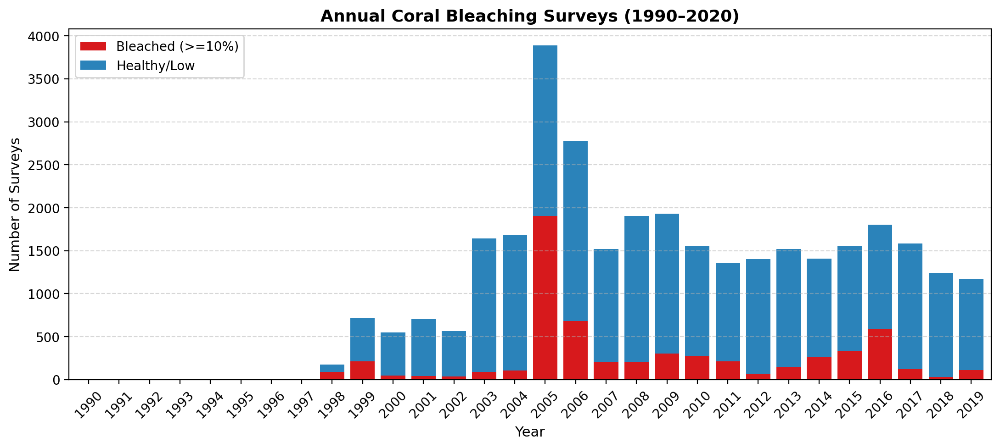

# Global Coral Bleaching Prediction & Thermal Stress Analysis

An end-to-end machine learning and exploratory spatial analysis pipeline to predict mass coral bleaching events across global tropical reefs using satellite-derived ocean temperature metrics and environmental drivers.

---

## 🌊 Overview & Scientific Context

Coral reefs are among the most biodiverse and economically vital ecosystems on Earth, supporting over 25% of all marine life and protecting coastal communities from extreme wave energy. However, anthropogenic ocean warming and recurring marine heatwaves (driven by natural climate cycles like ENSO) trigger catastrophic **coral bleaching**—a state where stressed corals expel their photosynthetic algal symbionts (*zooxanthellae*), turning stark white and risking starvation and mortality.

This project investigates the predictability of coral bleaching events using over **32,000 field-verified survey observations** matched with **NOAA satellite thermal stress metrics**. A baseline **Random Forest Classifier** is trained to forecast significant bleaching ($\ge 10\%$) with high discriminative accuracy.

---

## 📊 Exploratory Spatial Data Analysis (EDA)

### 1. Global Distribution of Surveyed Reefs (1980–2020)
Field surveys span across the Indo-Pacific, Coral Triangle, Caribbean, and Red Sea, covering both healthy and severely bleached reef tracts.


### 2. Thermal Stress Thresholds (Degree Heating Weeks)
Sustained heat accumulation (measured in NOAA Degree Heating Weeks, DHW) shows a dramatic separation between healthy and bleached reefs, validating the threshold hypothesis.


### 3. Historical Bleaching Timeline & Climate Oscillations
Mass bleaching observations spike during major El Niño events (1998, 2010, and 2015–2017), illustrating the strong coupling between global climate drivers and reef mortality.



---

## 🤖 Machine Learning Model Performance

A **Random Forest Classifier** (100 estimators, max depth 10) was trained on 80% of global observations and evaluated on an **unseen test set of 6,543 reefs** (20% holdout):

* **Overall Test Accuracy:** **88.0%**
* **ROC-AUC Score:** **0.897** (High discriminative ability)
* **Precision (Healthy):** **89%**


### Key Scientific Takeaways:
1. **Prolonged Heat Trumps Instant Heat:** Cumulative thermal stress (`TSA_DHW`) and baseline local temperature (`Temperature_Mean`) account for over **36% of model predictive skill**, confirming that prolonged exposure, rather than single-day anomalies, triggers bleaching.
2. **Physical Modifiers Matter:** `Cyclone_Frequency` (~13%), `Distance_to_Shore` (~11%), and `Depth_m` (~9%) act as critical local modifiers, either buffering thermal stress or introducing compounding sedimentation stress.

---

## 🗂️ Dataset Provenance

* **Dataset:** *Bleaching and environmental data for global coral reef sites from 1980–2020*
* **Archive:** Biological and Chemical Oceanography Data Management Office (**BCO-DMO Dataset 773466**, NSF-funded)
* **Principal Investigators:** Dr. Robert van Woesik & Dr. Deron Burkepile
* **Contributors:** Incorporates the global mass bleaching dataset compiled by **Donner et al. (2017)** and satellite SST / DHW metrics from **NOAA Coral Reef Watch**.

---

## 🚀 Getting Started

### Prerequisites
* Python 3.9+
* Required libraries: `pandas`, `numpy`, `matplotlib`, `scikit-learn`

```bash
pip install pandas numpy matplotlib scikit-learn
```

### Running the Notebook
Open and run the self-contained analysis notebook:

```bash
jupyter notebook coral_bleaching_prediction.ipynb
```

---

## 👤 Author
**Believe Nosakhare**  
Email: believehsam@gmail.com
